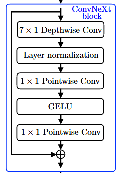

# Code Structure

主要介绍一下项目的代码结构。由于是标准的 encoder-vq-decoder 结构，代码结构也比较清晰。
阅读的顺序如下：

1. `encoder` 部分：论文中提到这里参考自 SoundStream 的设计，主要是一个 1D-CNN 的结构。因此略看。也可以将 SoundStream 的代码作为参考。
2. `vq` 部分：是一个单码本，可能需要和多码本对比
3. `decoder` 部分：可能是重点看的部分，增加了 attention 机制

## Encoder 部分

### `FeatureExtractor`

使用的完全是 `Encodec` 的结构，只不过由于此处为单码本，`bandwidths` 只包含一个值（`[6.6, 6.6, 6.6, 6.6]`）。

只包含 `SEANetEncoder` 和 `ResidualVectorQuantizer` 两个类（还定义了 `SEANETDecoder`）。

其中，`SEANetEncoder` 的主要结构就是 `Encodec` 的 `Encoder`，包含多个 `ResNetBlock` 和 `Conv1dSubsampling`，最后两层 `LSTM`，加一层卷积（全部都是因果卷积）。

#### Vector Quantizer
##### `EuclideanCodebook`

使用训练的第一个 batch 的数据进行 kmean 初始化码本。后面码本的更新使用 EMA 的方式。

一方面，码本向量使用 EMA 的方式更新，更加平滑和稳定；
另一方面，聚类大小也使用 EMA 的方式更新，当某些码本的使用频率过低时，就会使用当前的 batch 的数据进行替换（随机抽样）。

##### `VectorQuantization`

内部包含一个 `EuclideanCodebook`，额外增加了输入的 `project_in` 和输出的 `project_out` 两层线性变换（当输入输出维度和码本维度不同时使用）。
另外提供了 `commitment_loss` 的输出（$$||sg[E(x)] - x||_2^2$$）。

##### `ResidualVectorQuantization`

包含多个 `VectorQuantization` 组成的多码本结构。每个码本对残差进行量化。

> 一个很幽默的设计，为了满足 WavTokenizer 的单码本要求，这里的做法是重写一个 `LanguageVectorQuantization`，虽然创建了多个 `VectorQuantization`，但是每个码本量化的并不是前一个的残差，而是开始输入。这导致其实只用了一个码本。而 `encode` 和 `decode` 的接口没有做相应修改，一旦调用就会报错。最后创建的 `ResidualVectorQuantizer` 实例化了 `LanguageVectorQuantization`，直接使用 `forward` 可能也会报错，而 `infer` 则不会报错。

### `Discriminator` 

主要包含三种鉴别器：

- MultiResolutionDiscriminator：不同的 STFT 分辨率，`[nfft, hop_length, win_length]` 的三种配置（Univnet）
- MultiPeriodDiscriminator：不同的周期，`[2,3,5,7,11]` 的五种配置（HiFi GAN）
- DACDiscriminator:
  - MPD
  - MSD
  - MRD (Multi Band Spectrogram Discriminator)
> 通常设置 `bandwidth_id` 作为条件，代表不同的鉴别级别，从而提升或者放宽鉴别器的要求。

## Decoder 部分

### `AdaLayerNorm` 

自适应层归一化模块，支持不同的条件输入。主要用于在解码器中对特征进行归一化处理。
与标准的 `LayerNorm` 不同，`AdaLayerNorm` 根据输入的条件（如说话人ID、风格ID等）动态调整归一化的参数。

### `ConvNeXt`

首先需要了解的是 `depthwise convolution`，即深度可分离卷积。它将标准卷积分解为两个更简单的操作：深度卷积和逐点卷积（1x1卷积）。这样可以显著减少计算量和参数数量，同时保持模型的表达能力。

传统的卷积的卷积核大小为 $$(k, k, \text{in\_channels}, \text{out\_channels})$$，而深度可分离卷积分为两部分，第一部分每个通道单独卷积，卷积核的大小为 $$(k, k, 1, \text{in\_channels})$$。也就是为每个输入通道使用一个卷积核，输出通道数和输入通道数相同。第二部分是逐点卷积，卷积核的大小为 $$(1, 1, \text{in\_channels}, \text{out\_channels})$$，通过 1x1 卷积将输入通道映射到输出通道。我们可以比较一下参数量和计算复杂度：

| 卷积类型       | 参数量                     | 计算复杂度                     |
| -------------- | -------------------------- | ------------------------------ |
| 标准卷积       | $k^2\,\text{in\_channels}\,\text{out\_channels}$ | $k^2\,\text{in\_channels}\,\text{out\_channels}\,H\,W$ |
| 深度可分离卷积 | $k^2\,\text{in\_channels} + \text{in\_channels}\,\text{out\_channels}$ | $k^2\,\text{in\_channels}\,H\,W + \text{in\_channels}\,\text{out\_channels}\,H\,W$ |

> 其中，$H$ 和 $W$ 分别是输入特征图的高度和宽度。标准的卷积，每个输出通道的每个像素，需要进行 $k \times k \times \text{in\_channels}$ 次乘加操作。所以最后的计算复杂度是 $$k \times k \times \text{in\_channels} \times \text{out\_channels} \times H \times W$$。而深度可分离卷积，第一部分深度卷积，通道数不变，每个通道的每个像素点需要的计算是 $k \times k$ 次乘加操作，所以计算复杂度是 $$k \times k \times \text{in\_channels} \times H \times W$$。第二部分逐点卷积，每个输出通道的每个像素点需要进行 $\text{in\_channels}$ 次乘加操作，所以计算复杂度是 $$\text{in\_channels} \times \text{out\_channels} \times H \times W$$。将两部分相加，得到深度可分离卷积的总计算复杂度为 $$k \times k \times \text{in\_channels} \times H \times W + \text{in\_channels} \times \text{out\_channels} \times H \times W$$。
> 计算复杂度从原来的 $$k \times k \times \text{in\_channels} \times \text{out\_channels} \times H \times W$$ 降低到了 $$k \times k \times \text{in\_channels} \times H \times W + \text{in\_channels} \times \text{out\_channels} \times H \times W$$，尤其是在卷积核较大或者输出通道数较多时，计算复杂度的降低非常显著。

> 存储复杂度方面，标准卷积的参数量为 $$k \times k \times \text{in\_channels} \times \text{out\_channels}$$，而深度可分离卷积的参数量为 $$k \times k \times \text{in\_channels} + \text{in\_channels} \times \text{out\_channels}$$。可以看到，深度可分离卷积的参数量也显著减少，尤其是在卷积核较大或者输出通道数较多时。

`ConvNeXt` 的主要结构如下图所示：

本文还使用了 `attention` 机制，因此前面先进行若干个 `ResNet+Attention` 模块的堆叠，然后再进行 `ConvNeXt` 模块的堆叠。

### head

是重建音频的最后一步，主要包含三种：

- `ISTFTHead`
- `IMDCTSymExpHead`
- `IMDCTCosHead`

